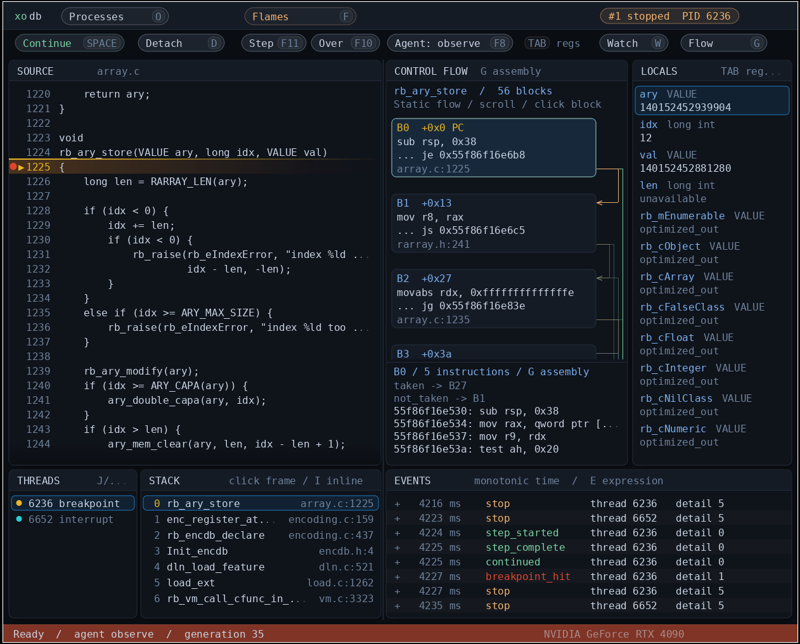

# xodb

A graphical, Linux-native debugger. The hugs and kisses debugger.

Not a GUI bolted onto GDB. Not a chat panel bolted onto a debugger. Not an IDA
clone. It's a live visual instrument for understanding software — debugger,
disassembler, profiler, tracer, and agent playground sharing one semantic model
of your program.

Zig. Wayland. Vulkan. FreeType/HarfBuzz. No Electron, no webview, no 1990s
widget toolkit. Dark, dense, keyboard-driven with a huge nod to RAD Debugger's
visuals (but not a clone- it's linux-first and cross-arch read on)

## ⚠️ The disclaimer you should read first

This is a **challenge project**: 24 hours of work to make a functioning
debugger and a followup week to see how hard it can be productionalized,
starting **2026-09-30**. I want to find out how much I could do with AI
in a stupidly short amount of time. **This initial push is an early peek on day
3.** Don't expect it to be nice for like, at least one more day ok.

So: it works, there are tests, there's a *lot* of it — and it will absolutely
fall over in ways a 20-year-old debugger wouldn't. We're fuckin' around and
making stuff. Mind the edges, read [Current limits](#current-limits).

This is pre-alpha. If it doesn't work, have your agent fix it and send a pr.

## Guiding principles

- **Graphical, fast, flashy.** The UI is the product, not a courtesy wrapper.
- **AI-native by design.** MCP interfaces built for agent control and analysis
  from day zero — humans and agents drive the *same* model, the same evidence.
- **Linux native in all ways.** ptrace, perf, /proc, pidfd, eBPF, uprobes,
  hardware debug registers. (not all *implemented* yet, mind)
- **Portable where it counts.** Not glued to x86-64, ELF, DWARF, or 64-bit
  pointers. AArch64 matters to us and is first class, more coming.
- **Non-PC:** remote debugging (Android especially), planned Lua scriptability
  with `dbg.eval()`, replay, object/causal graphs.
- **One model, three readers:** human understanding, agent understanding,
  machine-verifiable semantics. A design has to improve all three.

The long version — the whole architectural brief this thing grew from — lives in
[linux-ai-debugger-agents.md](linux-ai-debugger-agents.md).

### Screenshot



*Stopped on `rb_ary_store` in CRuby: source, static control-flow graph with the
selected block's disassembly, decoded `VALUE` locals, threads, stack, and the
event timeline.*

Keys, in brief: **F10** step over · **G** graph/asm · **P** profile · **F**
flames · **E** expression entry · **V** watch/events · **Tab** locals/registers
· **J/K** threads · **D** detach · **F8** grant or yank agent control.
Letter shortcuts follow your active keyboard layout.

## What actually works today

**Process control.** Launch or attach, continue, interrupt, detach, per-thread
inspection. Software breakpoints by address, symbol, or file:line. Instruction
and source stepping, step-over. Worker-thread exec, main-thread-exits-first,
up to 1,024 threads.

**Source debugging.** ELF modules, DWARF 4/5 via libdw, CFI unwinding, locals
for the selected frame, C/C++ scalars/pointers/structs/arrays, side-effect-free
expressions with `$register` access, Rust/Zig slice and text previews. Explicit
*optimized-out* / *unavailable* / *unsupported* results instead of lies.

**Hardware write investigations.** Point at `item->value`, hit **W**, run. xodb
records the write (`7 -> 12`), the thread, registers, frames, locals, source
location, and the derived preceding instruction — then exports the whole
investigation to JSON as evidence.

**CPU profiling.** perf sampling, flame graphs with zoom and self/inclusive
counts, a linked timeline with drag-select ranges and optional scheduling lanes,
sampled stacks with background DWARF reconstruction, saved capture archives,
offline reopen, speedscope export.

**Static navigation.** Bounded control-flow graphs, basic blocks, branch edges,
honest *unresolved transfer* markers. Click a block, read its source and asm,
nothing executes.

**Allocations.** Native allocator calls, reallocs, frees, lifetime and
outstanding views, allocation caller stacks and byte/count heap flames — with
MCP evidence and save/reopen. See [docs/ALLOCATIONS.md](docs/ALLOCATIONS.md).
CPU archives can be compared with `--compare-capture before.xoc --open-capture after.xoc`;
see [profile comparison](docs/PROFILE_COMPARISON.md). Single-thread x86-64 source
stepping now batches straight-line instructions; see [source stepping](docs/SOURCE_STEPPING.md).

**Themes.** Built-in dark, light and contrast palettes and custom JSON colors,
selected at startup for local, remote and offline views. See [themes](docs/THEMES.md).

**C runtime.** Target control and kernel collectors have one C implementation,
used locally and by `xodb-agent`. Build the agent with GCC or Clang; it needs no
Zig or GUI libraries. The host GUI/MCP keeps symbols, expressions and profiling
analysis, including cross-ISA debugging of an m68k target.
See [C runtime builds, commands and limits](docs/C_RUNTIME.md).

**Remote + ARM64.** The x86-64 workstation GUI drives a headless xodb on an
AArch64 Jetson over SSH or LAN TCP. ARM64 hardware data watchpoints work through
MCP. Android: native executables *and* JNI libraries inside a debug APK, over USB.
([ARM64](docs/ARM64.md) · [remote](docs/REMOTE_DEBUGGING.md) ·
[Android](docs/ANDROID.md))

## Build and run

The GUI baseline is Linux x86-64, a Wayland session, a working Vulkan driver,
and **Zig 0.16 or newer**. ARM64 currently uses the headless backend. See
**[SETUP.md](SETUP.md)** for tracing permissions and headless builds.

Install the compiler tools, development headers, shader compiler and default
font for your distribution. These commands cover the application build;
[test dependencies](docs/DEPENDENCIES.md) are separate.

```sh
# Arch Linux
sudo pacman -S --needed base-devel zig pkgconf wayland wayland-protocols \
  libxkbcommon vulkan-headers vulkan-icd-loader shaderc freetype2 harfbuzz \
  capstone libelf ttf-dejavu
XODB_FONT=/usr/share/fonts/TTF/DejaVuSansMono.ttf
```

```sh
# Debian / Ubuntu (install Zig separately if it is not in your repository)
sudo apt install build-essential pkg-config libwayland-dev libwayland-bin \
  wayland-protocols libxkbcommon-dev libvulkan-dev glslc libfreetype-dev \
  libharfbuzz-dev libcapstone-dev libdw-dev libelf-dev fonts-dejavu-core
XODB_FONT=/usr/share/fonts/truetype/dejavu/DejaVuSansMono.ttf
```

```sh
# Fedora
sudo dnf install gcc zig pkgconf-pkg-config wayland-devel wayland-protocols-devel \
  libxkbcommon-devel vulkan-loader-devel vulkan-headers glslc freetype-devel \
  harfbuzz-devel capstone-devel elfutils-devel elfutils-libelf-devel \
  dejavu-sans-mono-fonts
XODB_FONT=/usr/share/fonts/dejavu-sans-mono-fonts/DejaVuSansMono.ttf
```

```sh
# openSUSE Tumbleweed (pkgconfig capabilities select the development packages)
sudo zypper install gcc zig pkgconf shaderc dejavu-fonts \
  'pkgconfig(wayland-client)' 'pkgconfig(wayland-scanner)' \
  'pkgconfig(wayland-protocols)' 'pkgconfig(xkbcommon)' 'pkgconfig(vulkan)' \
  'pkgconfig(freetype2)' 'pkgconfig(harfbuzz)' 'pkgconfig(capstone)' \
  'pkgconfig(libdw)' 'pkgconfig(libelf)'
XODB_FONT=/usr/share/fonts/truetype/DejaVuSansMono.ttf
```

Zig is not pinned to an exact compiler version. **0.16.0** is the last verified
baseline; newer compilers should be checked with the build and test suite, and
compatibility fixes are welcome. Build reports record `zig version` without
rejecting newer releases. The [official Zig downloads](https://ziglang.org/download/)
provide standalone toolchains. The GUI also requires the stable tablet-v2 XML
from **wayland-protocols 1.36 or newer**; older distribution releases may need
updated development packages. Install your GPU's Vulkan driver separately if
your desktop does not already have one; the Vulkan loader alone is insufficient.

Then, in the same shell:

```sh
./scripts/build -Doptimize=ReleaseSafe -Dfont-path="$XODB_FONT"
./zig-out/bin/xodb -- path/to/program arg1 arg2
./zig-out/bin/xodb --attach 12345
./zig-out/bin/xodb --help
```

`--font /path/to/font.ttf` overrides the compiled default. Build your target
with `-g -O0` for the simplest source debugging experience.

Local **RPM, Debian and Arch package recipes** are included; see
[packaging/README.md](packaging/README.md) for source snapshots and build commands.
They are development packaging, not published distribution packages.

### Demo

```sh
./zig-out/bin/xodb --break change_value --source tests/fixtures/m1.c \
  --record ".work/manual-m1-$(date +%Y%m%dT%H%M%S).json" \
  -- ./zig-out/bin/xodb-m1-fixture
```

**Space** to continue · **F11** steps a source line · click `item->value` in
Locals, press **W** · **Space** again and watch it catch the store · **Q** saves
the investigation. Full walkthrough and limits: [docs/M1.md](docs/M1.md).

Other things to poke at: `./scripts/demo-cruby` (break on `rb_ary_store`, decode
a Ruby VALUE by hand), the [M2 flow graph](docs/M2.md), and
[flame graphs](docs/PROFILING.md). #TODO their ruby will be stripped though


## Agents

Point any MCP client at:

```text
zig-out/bin/xodb --headless --mcp -- /absolute/path/to/program
```

Drop `--headless` and the GUI and the agent share one live session — same
threads, same stops, same evidence. MCP `2025-06-18`, newline-delimited
JSON-RPC, stdio or single-client TCP.

Scopes are deliberate: **observe** by default; `--agent-scope control` adds
breakpoints, stepping, profiling and `investigate_write`; `mutate` adds memory
and register writes. Every control action must present the current session
`generation`, so stale agents get rejected. **F8** revokes control from the GUI
mid-flight. There's an action audit. There's no embedded LLM — bring your own.

[MCP overview](docs/MCP_OVERVIEW.md)

## Current limits

- Native target backends are Linux x86-64 and AArch64. Opt-in x86-64
  [fork/vfork following](docs/PROCESS_TREES.md) retains 32 process sessions by
  default, configurable up to 1,024. Job-control workflows remain limited.
- Basic C/C++ types, no function calls, casts, bitfields, or inheritance.
  [Split DWARF and separate debug files](docs/DEBUG_SYMBOLS.md) are supported
  with documented limits. Signal-frame unwinding remains unsupported.
- Four x86 debug slots, aligned 1/2/4/8-byte watches. A watchpoint samples —
  it is **not** a replay trace. Concurrent writes can slip between samples.
- Source stepping is instruction-driven with a 10,000-instruction ceiling. It
  needs to get faster.
- Fixed 1,024-thread / 4,096-event capacities per process; old events expire.
  Source files are capped at 1 MiB.
- [Startup colors and presets](docs/THEMES.md); one adjustable divider, no saved layouts, docking or theme editor yet.
  Text starts at 16px; scaling and accessibility need real work.
- No reverse execution, replay, decompiler, or GPU tracing.
  [Syscall timing](docs/SYSCALL_TIMING.md) is opt-in for selected x86-64 threads;
  [core debugging](docs/CORE_DEBUGGING.md) is read-only.
- **License: GPLv3** System dependencies and their observed licenses
  are catalogued in [docs/DEPENDENCIES.md](docs/DEPENDENCIES.md).

The per-feature docs describe current limits; [DAY1.md](DAY1.md) preserves the
initial feature snapshot.

## What's next

- Skinnable, flexible display: font scaling, skin controls and pane layouts you can save; startup themes are available.
- AArch64 feature coverage: precise multi-watch attribution, modern ARM
  validation, profiling, native ARM GUI.
- More architectures, and the hardware or emulation to actually validate them.
- Your issues and PRs - file 'em please

[TODO.md](TODO.md) · [milestones](docs/MILESTONES.md) ·
[agent tasks](docs/AGENT_TASKS.md) · [findings journal](docs/journal.md)

## Tests

```sh
timeout 45 ./scripts/build test --summary all
python3 tests/mcp.py
python3 scripts/gui-smoke.py --m1
```

~70 integration scripts in `tests/`, including GUI smoke tests that spin up a
private headless Sway session and drive a virtual pointer, differential checks
against GDB, and a Vulkan render-fault injector. Run them outside the agent
sandbox — it denies ptrace and hides the GPU, which is the whole point.
