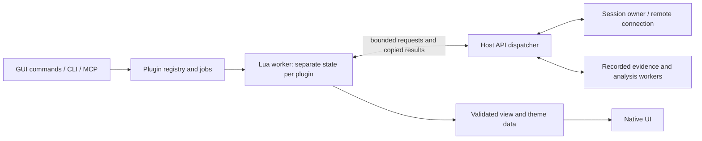

# Lua plugin architecture sketch

2026-10-02. Discussion proposal for review. APIs, packaging and defaults below
are proposed; Lua integration is not implemented or adopted by this document.

The useful unit is a plugin that adds debugger commands, understands a program's
data, produces analysis, or customizes presentation. Lua requests operations
through a small host API. The existing session continues to own tracing and
evidence, and the native UI renders plugin results.

## Uses

| Use | Example |
| --- | --- |
| Program and runtime inspection | Decode CRuby VALUEs, summarize a game's entity or a server's request object, with explicit runtime/build compatibility |
| Reusable investigations | Inspect several fields at a stop; install a named set of probes; collect values when an owned watch fires |
| Profile analysis | Group frames by subsystem, summarize selected threads, compare retained views and add derived annotations with sample citations |
| Presentation | Custom value summaries and expandable children; tables of game objects; navigation to the evidence behind a row |
| Personalization | Theme palettes, fonts/density preferences, named layouts and command bindings |
| Agent tools | Let an external agent invoke the same registered command and receive structured results, within its current scope |

The CRuby plugin would read native state through DWARF/memory inspection. Calling
Ruby functions inside the inferior is a separate run-control feature; `dbg.eval`
starts with the existing side-effect-free native expression evaluator.

## Architecture



Start with one dedicated Lua worker, scheduling a separate Lua state for each
enabled plugin. The worker owns those states. The session owner handles live
debugger requests; existing analysis workers handle expensive recorded queries.
Native rendering consumes published results and never calls Lua during drawing.

A binding such as `dbg.eval(expression, context)` submits a request and yields
the invocation's coroutine. When the result arrives, the worker resumes it.
The script reads naturally, while the GUI/session loop remains free to process
input, target events and cancellation. Each plugin initially runs one invocation
at a time; callbacks queue behind it with explicit bounds.

Shared states, session pointers, target pointers and renderer objects never cross
the API. Requests and responses carry owned data or validated opaque handles.
Local and remote adapters expose the same operations where the backend supports
them. Unsupported features produce capability errors.

For a remote GUI, plugins normally run on the desktop and use its existing
connection. They do not open a second controller connection or get uploaded to
the phone. A plugin explicitly installed in a headless service can run there;
GUI operations are unavailable in that environment. Capability discovery reflects
these differences, including imported/offline versus live sessions.

## Plugin package and lifecycle

```text
plugins/native-tools/
  plugin.json
  init.lua
  themes/dark.json
```

The data manifest declares an ID, plugin version, xodb API version, optional Lua entry point,
requested capabilities and namespaced settings with defaults. Commands declare
argument/result schemas and effects. The host assigns identities and provenance;
plugin-provided text cannot grant permissions. Plain theme data can be loaded
without starting a Lua state.

Explicit `--plugin PATH` or an enabled entry in an explicitly loaded preferences
file selects a plugin. Opening an executable, source tree or capture does not
execute its accompanying scripts. Resource loading is confined to the selected
package through host helpers; dependencies can initially be bundled Lua modules.

Load and validate a candidate's registrations before publishing them. Registration
does not perform target actions. Explicit reload publishes a valid replacement or
retains the old registration. Retire old jobs and resources deliberately; unloading
must not run an unbounded cleanup callback. Persistent state starts as explicit,
namespaced data, with no automatic preference write-back.

## Public touch surfaces

All names here are illustrative.

| Surface | Proposed API | Contract |
| --- | --- | --- |
| Inspection | `dbg.context`, `dbg.eval`, `dbg.stack`, `dbg.locals`, `dbg.read_memory`, `dbg.symbol` | Explicit session/thread/frame and stop identity; bounded reads; availability preserved |
| Debug control | `dbg.breakpoint`, `dbg.watch`, `dbg.continue`, `dbg.interrupt`, `dbg.step` | Asynchronous actions, fresh generation, explicit control grant; probes have owners |
| Mutation | `dbg.write_memory`, `dbg.write_register` | Separate mutation grant and audit; no implicit target calls from evaluation |
| Commands | `xodb.command` | One registration usable by GUI, CLI and MCP; typed arguments and results |
| Events | `xodb.on` for public stop, exit, module change and capture completion | Queued delivery after coherent state publication; event identity and origin included |
| Formatters | `format.register` | Read-only summaries/children for matching types and runtimes; raw values remain accessible |
| Analysis | `profile.view`, `profile.samples`, `profile.annotate` | Stable view IDs, revisions and sample citations; derived output is labelled |
| UI | `ui.publish`, `ui.navigate` | Host-owned text/table/tree panels and source/frame selection; declarative updates |
| Themes | `theme.register` | Validated semantic colors and metrics; runtime theme application is native |
| Preferences and resources | `prefs.get`, `plugin.resource` | Namespaced settings and bounded package assets; explicit persistence |
| Diagnostics | `xodb.log`, job status/cancel | Per-plugin errors, timing, output limits and invocation IDs |

A callback never runs for every perf sample or every rendered frame. Selection
and progress events can coalesce to the newest value. Stop-event overflow reports
a gap and forces resynchronization before event-driven control; it cannot silently
pretend all stops were observed. Internal breakpoint rearming and ARM watch
completion traps are not public plugin stops.

Formatters run asynchronously and publish a cached result tagged with the stop
identity. Pending, stale or failed formatting leaves the native/raw view usable.
Plugins that recognize runtime layouts must check type/build/version evidence.

Themes use the existing semantic palette as a starting point. Today colors also
exist as constants in individual panes, so runtime theme support requires routing
those through one theme object. Palette loading can arrive early; a layout editor
and arbitrary drawing API are separate UI work.
The [skins and look and feel sketch](SKINS_PROPOSAL.md) expands the theme,
configuration and layout design with example data files.

## Invocation and data contracts

An invocation receives a captured context: session ID, image epoch, generation,
thread identity and selected frame, or an immutable capture/view identity. GUI
selection is captured when invoked; headless and MCP callers supply it explicitly.
The context detects changes and does not lock the target. Each live operation
revalidates it; a human Continue causes stale operations to fail. Scripts must
request a new context deliberately. Previously returned observations retain their
original identity and cannot be relabelled as current.

Return typed values with raw bits/address, display text, type and availability.
Use opaque address/u64 values with checked conversions and canonical hex on the
wire. This avoids accidental float rounding and unsigned-comparison surprises.
Handles cannot retain borrowed frame/DWARF memory after a stop or image changes.

An illustrative command, with its `expressions` array bounded by a registered
schema, could be:

```lua
local xodb = require("xodb")
local dbg = require("xodb.dbg")

xodb.command("watch_summary", {scope = "observe"}, function(ctx, args)
    local rows = {}
    for _, expression in ipairs(args.expressions) do
        local value = dbg.eval(expression, ctx) -- yields while the host inspects
        rows[#rows + 1] = {
            expression = expression,
            value = value.display,
            availability = value.availability,
        }
    end
    return {rows = rows, evidence = ctx:evidence()}
end)
```

The GUI can render the returned rows; MCP receives the same data and evidence.
This is proposed API syntax, not a runnable plugin for the current binary.

## Permissions and limits

Inspection is the default. Debug control, mutation, UI changes and host I/O are
distinct capabilities. Effective target permissions intersect the plugin's grant,
the invocation caller's permissions and current session automation policy. Queued
requests are checked again at execution, so revocation applies immediately.
An MCP caller cannot borrow a plugin's stronger grant. A script invoked from the
GUI still uses a plugin identity and cannot bypass checks as a human action.

The audit records plugin/version, invocation, initiating human or agent, operation
and context. A plugin owns the probes and subscriptions it creates. Removing or
reloading it removes only its resources; shared probes need owner references.
Keep ownership records until the engine confirms probe restoration, including
when cleanup must wait for a safe stop. A retired Lua state cannot leave untracked
breakpoints in the target. Cancellation prevents further actions and reports actions already applied. It
does not roll back memory writes or automatically resume a stopped target.

Configure memory, active CPU/instruction budget, elapsed job deadline, request and
result sizes, queued jobs, event rate and log volume. Count memory held in host
responses/views as well as Lua allocations. Use cumulative per-job budgets across
yields; RPC waiting time is distinct from active execution time. Fair scheduling
and bounded host dispatch keep a plugin's repeated requests from monopolizing the
session owner. Expensive operations retain native worker paths.

Initially expose selected Lua libraries and package-local Lua modules. Raw `io`,
`os`, `debug`, native module loading and FFI are unavailable; future file/network
operations would be explicit host APIs. Limit exhaustion marks the invocation
terminal and may disable its plugin, even if Lua code catches a normal error.
Report a traceback and retain the debugger session.

These measures provide controlled extension behavior for explicitly enabled
plugins. An in-process Lua state is not a security boundary against hostile code
or a hard deadline for every native library function. Arbitrary MCP-supplied code
needs separate consideration, including a helper process if hard termination is
required.

## MCP integration

Begin with `list_plugin_commands`, `invoke_plugin_command`, `get_plugin_job` and
`cancel_plugin_job`. Invocation returns a job ID; clients poll bounded results and
receive the same schemas, capabilities and evidence as GUI invocations. Named
commands reuse a plugin the user enabled. Dynamic tool-per-command exposure can
follow once discovery and schema invalidation are settled.

An opt-in `lua.run` for ad hoc snippets is a useful later surface for external
LLMs: batch inspections and return a concise structured answer. Start that path
with a fresh state, inspection-only scope and separate enablement. It must not
gain plugin-installation rights or capture another caller's privileged closures.
No LLM runtime is embedded in xodb by this proposal.

## Implementation touch points

| Area | Change |
| --- | --- |
| New `src/plugins/` modules | Manifest/registry, job queue, Lua worker, value/context bindings and bounded results |
| New small C boundary | Contain Lua error/yield control flow; return ordinary results across the Zig boundary |
| `src/model/session.zig` | Dispatch permitted operations on its owner; extend actor/audit identity; keep existing generation checks |
| `src/mcp/server.zig` | Plugin discovery/invocation/job tools using the dispatcher; keep MCP framing separate |
| `src/main.zig` and `src/preferences.zig` | Explicit loading, configuration, queue pumping and bounded shutdown |
| `src/remote/client.zig` | Serialize plugin requests alongside human requests over the existing connection; capability adaptation |
| `src/model/value_view.zig` and UI panes | Formatter registry, pending/stale results and host-rendered plugin panels |
| `src/ui/style.zig` and pane colors | Runtime theme object and declarative theme loading |
| Existing profile view workers | Supply bounded stable inputs to Lua analysis; retain collection and unwinding in native code |
| Build and reliability gate | Lua dependency, cancellation/memory/error tests, scope/staleness and GUI responsiveness tests |

MCP currently performs some authorization/dispatch around direct Session calls;
wrapping those calls from a worker would bypass ownership and some policy. Extract
the operations the first bindings need into a shared dispatcher incrementally.
A wholesale conversion of every existing operation is unnecessary for the first
usable plugin.

## Runtime recommendation and critical review

Use standard PUC Lua, initially **5.5.1**, which is already installed here and is
the [current upstream release](https://www.lua.org/download.html). Its C API offers
[custom allocation](https://www.lua.org/manual/5.5/manual.html#lua_newstate),
[instruction hooks](https://www.lua.org/manual/5.5/manual.html#lua_sethook) and
[continuations for yielding](https://www.lua.org/manual/5.5/manual.html#4.5).
The dependency/build choice remains for adoption; no packages were installed.
Keep Lua API calls that can raise/yield inside a carefully designed C boundary:
Lua's nonlocal control flow must not skip Zig cleanup frames. Hook budgets do not
preempt arbitrary long-running C functions, so bindings and exposed library inputs
also need bounds.

The strongest benefit is making program-specific knowledge reusable across the
GUI and agents: a CRuby decoder, game inspector or profile report becomes a small
plugin. The principal design costs are lifetime/stop identity, cancellation, and
avoiding UI stalls from either Lua or the host requests it issues. A worker alone
does not solve an expensive synchronous Session call; per-request work must still
be bounded or delegated. Separate states isolate plugin globals and accounting,
but a shared worker can still be occupied by a slow native Lua operation.

The main scope risk is building a full plugin platform before delivering a useful
script. I would implement a narrow first slice: explicit loading, the worker/API
boundary, context plus read-only `dbg.eval`/stack/locals, command registration and
named MCP jobs. Demonstrate a multi-expression native-state report and keep its
output inspectable. Add data-driven themes and a minimal native command/results
surface next, followed by runtime formatters and reviewed control hooks. Broader
layout customization, filesystem/network access and arbitrary MCP snippets can
use the same boundaries when their concrete workflows are ready.
