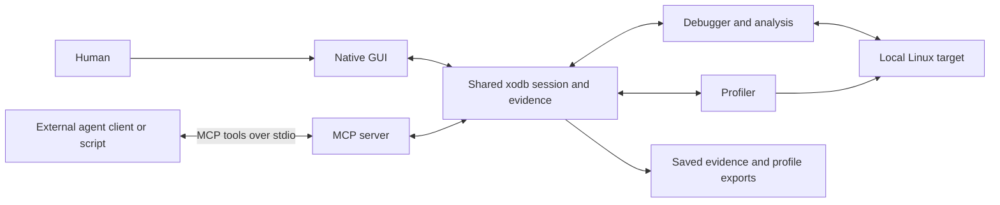

# MCP and machine interfaces: working overview

**Discussion sketch, 2026-10-01.** Current implementation plus tentative
directions; this is not a binding API design.

## The basic picture

xodb owns debugger state and evidence. An external agent client asks questions
and requests permitted actions. Models can run locally or remotely; xodb has no
embedded LLM. Scripts can use the same interface.



GUI and MCP use the same state. MCP usually names a thread, frame or filter
explicitly; it can also read the GUI's displayed profile selection. General
“what the human is looking at” context remains a possible extension.

## Which interfaces exist?

| Surface | Current role |
| --- | --- |
| **Command line** | Start xodb, choose launch versus PID attach, enable GUI/headless operation, set agent scope and shutdown exports. Target selection currently happens here. |
| **MCP** | Discover named operations, inspect structured data, request permitted debugger actions and query their outcomes. |
| **Internal Zig model** | Shared implementation used by GUI and MCP. It is evolving, with no public library/ABI commitment. |
| **Linux target/collector interfaces** | Process control, memory/register access and perf collection behind xodb's target/profile modules. |
| **Files** | Investigation JSON and Speedscope aggregate exports. Native archives support offline reopening, recorded annotations and guarded background saves; see [M2_ARCHIVES.md](M2_ARCHIVES.md). Application timing can enter through guarded MCP imports. |

xodb implements MCP `2025-06-18` tools over newline-delimited JSON-RPC on stdio.
See the [MCP tools](https://modelcontextprotocol.io/specification/2025-06-18/server/tools)
and [stdio transport](https://modelcontextprotocol.io/specification/2025-06-18/basic/transports)
specifications for the envelope; xodb defines the debugger operations inside it.

The client launches xodb and keeps its stdin/stdout connected, for example:

```sh
./zig-out/bin/xodb --headless --mcp --agent-scope observe --attach PID
```

Omit `--headless` to include the GUI. Today this gives one client connection to
one xodb session. Connecting additional agents to an already-running GUI needs
further transport/session work. A one-client TCP listener and an SSH/TCP GUI
client now exist; see [remote debugging](REMOTE_DEBUGGING.md). HTTP, Unix sockets,
MCP resources and prompt catalogs are not implemented. Diagnostic and target
output goes to stderr; stdout carries
MCP messages. Disconnecting stdio ends xodb; launched targets are cleaned up and
attached targets are detached.

## What can a machine ask for?

Examples, rather than an exhaustive tool catalog:

| Intent | Representative tools |
| --- | --- |
| Understand the session | `get_session`, `list_threads`, `list_modules`, `query_events` |
| Inspect code and values | `get_stack`, `list_locals`, `get_value_children`, `read_memory`, `get_function_graph`, `get_instruction_effects` |
| Run an experiment | `set_breakpoint`, `set_watchpoint`, `continue`, `interrupt`, `step_over` |
| Explain a recorded write | `investigate_write`, `get_investigation`, `get_audit` |
| Investigate CPU cost or a stall | `start_profile`, `get_flamegraph`, `get_profile_timeline`, `get_profile_schedule` |
| Inspect allocator activity | `start_allocations`, `stop_allocations`, `get_allocation_capture`, `get_allocation_calls`, `get_allocation_lifetimes` |
| Retain a stopped context | `start_inspection`, `get_inspection`, `cancel_inspection`, `release_inspection` |
| Compare individual native calls | `start_observation`, `get_observation_calls`, `compare_observation`, `associate_observation` |
| Add or retain evidence | `add_profile_intervals`, `get_profile_intervals`, `export_profile` |
| Deliberately change target state | `write_memory`, `write_register` |

Inspection jobs retain copied registers, stack, locals, expressions and bounded
memory reads under one stopped generation. Function observations retain raw ABI
words and entry/return evidence, with asynchronous comparison, temporal
association and `.xoi` save/open jobs. See [OBSERVATIONS.md](OBSERVATIONS.md) for
commands, paging, scope and evidence limits. These features currently use CLI/MCP.

Allocation tools use explicit thread/hook scope, bounded evidence and a separately
configured helper where required; [workflow and limits](ALLOCATIONS.md#mcp).

After initialization, `tools/list` supplies available tools and argument schemas;
CPU flames default to recorded kernel callchains. T16 adds an explicit
`get_flamegraph basis:"reconstructed"` for completed captures, with coverage
counts and contributing sample ordinals; `get_profile_stack` inspects each
sample's saved evidence and derived frames. These observe-scope queries build
on a worker and may first return pending progress.
[Workflow and limits](M2_SAMPLED_UNWIND.md#reconstructed-flames-over-mcp).

`tools/call` returns structured results. Unknown values, partial stacks and lost
events carry explicit limitations. Off-CPU duration alone cannot identify a lock
or prove which thread caused a wait.

Imported simpleperf sessions (`--open-profile FILE`) instead advertise four
read-only tools: `get_session`, `get_imported_profile`,
`get_imported_flamegraph`, and `get_imported_sample`. They use immutable
import/view identities, sample citations and period weights, with separate GUI
and MCP filter workers. [Import contract and workflow](SIMPLEPERF_IMPORT.md#mcp).

## Scope, identity and the usual interaction loop

Current scopes are **observe** (default), **control** (execution, probes,
profiling and evidence import/export), and **mutate** (adds target memory/register
writes). xodb enforces scope when executing a request. The GUI can revoke control
with F8; actions are audited. These are xodb permissions within the OS access
already available to the process.

Actions carry the current session **generation** to reject stale requests after
human actions or events. Captures have a separate **ID and revision** for evidence
queries. These checks detect changes; they do not freeze the session.

A typical investigation is:

1. Read state and scope; inspect a thread or capture.
2. Request an allowed action with the current generation.
3. Poll `get_session` / `query_events` for its outcome. Execution controls are
   asynchronous.
4. Query bounded, paged evidence with consistent revisions; explain findings or
   request another experiment.

Starting a profile does not resume a paused target, and stopping collection does
not pause execution. A client controls those separately. Event history is bounded;
this is currently polling with sequence numbers, not a durable event subscription.

## Likely directions — still open

- **Lua scripting (future feature):** debugger bindings such as `dbg.eval()`,
  configurable behavior and resource limits, and possible MCP access to those
  bindings. Use the shared model and preserve the caller's session permissions
  and generation checks. The API and runtime design remain open.
- **Several agents sharing a GUI session:** a local endpoint or broker, client
  identity, separate scopes, and a rule for who may control execution. A single
  controller with multiple observers is one plausible starting point.
- **Subscriptions and longer jobs:** archive jobs now expose polled progress and
  cancellation. Stop/capture subscriptions and reconnect behavior remain open.
- **Larger evidence:** native archives now retain full capture evidence and
  expose raw sample ordinals plus artifact/view identities. General MCP resource
  references and asset bundles remain possible extensions.
- **Richer investigations:** probes, allocation/object relationships and language
  adapters exposed through the shared model, with provenance and uncertainty.
- **Android/remote Linux:** a target-side service and serial/network transport
  beneath the debugger model remain future work. The first remote GUI already
  controls a target-side xodb through MCP over SSH or TCP, with bounded
  `get_debug_view` snapshots. A local MCP proxy/multiple clients are pending.
  This does not select the Android/serial target protocol; MCP need not carry
  raw target-control traffic.

Tool grouping, naming, transport, client ownership and bulk-data handling remain
open to revision as we test real workflows.

For implementation details, see [external-agent setup](../README.md#external-agents),
[profiling](PROFILING.md), [value views](M2_VALUES.md), and the
[current server](../src/mcp/server.zig).
